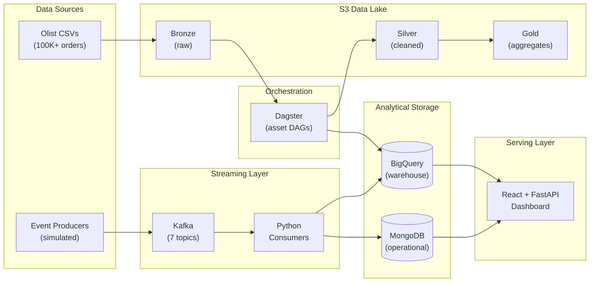

# Platform Architecture — E-Commerce Streaming Analytics

> End-to-end architecture for a Lambda-style analytics platform that unifies batch and real-time e-commerce data into a single queryable layer.

---

## Overview

E-commerce platforms generate two fundamentally different types of data: **historical transactions** (orders, payments, reviews) that accumulate over months and years, and **real-time events** (clickstream, live orders, experiment assignments) that matter in the moment. Serving both from a single system forces painful trade-offs — optimizing for analytical queries over historical data conflicts with low-latency ingestion of live events.

This platform solves the problem using a **Lambda architecture**: a batch layer processes full historical data on a schedule, a speed layer ingests events in real-time, and a serving layer merges both into unified views. The result is a complete picture of business activity with latency ranging from seconds (for live events) to hours (for historical reprocessing).

---

## System Architecture

### High-Level Data Flow



### Batch Path

```
Olist CSVs (Kaggle) → S3 Bronze → Dagster (raw → staging → dimensions → facts) → BigQuery marts
```

- **Latency:** Hours (daily schedule)
- **Data scope:** Full historical dataset (2016–2018, ~100K orders)
- **Update frequency:** Daily or on-demand materialization

### Speed Path

```
Event Producers → Kafka topics → Python Consumers → MongoDB + BigQuery realtime dataset
```

- **Latency:** 2–5 seconds end-to-end
- **Data scope:** Rolling 24–48 hour window
- **Update frequency:** Continuous, event-driven

### Lambda Merge

The serving layer queries **unified views** in BigQuery that combine batch mart tables with the realtime dataset, using timestamp boundaries to avoid double-counting. This is the core of the Lambda pattern — consumers of the data never need to know whether a record came from the batch or speed layer.

> **Why Lambda over Kappa?** A pure Kappa architecture (stream-only) would reprocess the entire Olist historical dataset through Kafka on every schema change or backfill. For a dataset of this size that is not a dealbreaker, but Lambda better demonstrates the architectural pattern used by most production e-commerce platforms where batch and stream coexist. It also allows the batch layer to apply heavier transformations (joins, deduplication, SCD handling) that are awkward in a streaming context.

---

## Component Architecture

| Component | Role | Technology | Deployment |
|-----------|------|------------|------------|
| **Data Lake** | Raw and processed data storage | AWS S3 (bronze/silver/gold) | AWS free tier |
| **Stream Broker** | Event ingestion and distribution | Apache Kafka (Docker) | Local, 1 broker |
| **Orchestrator** | Batch pipeline DAGs and scheduling | Dagster | Local (`dagster dev`) |
| **Operational Store** | Low-latency reads, flexible schema | MongoDB (Atlas M0) | Free tier cluster |
| **Warehouse** | Analytical queries, batch + stream | Google BigQuery | Serverless, pay-per-query |
| **Dashboard** | Visualization and API layer | React + FastAPI | Local development |

---

## Technology Choices and Trade-offs

### Kafka — Event Streaming

**Chosen because** Kafka provides a durable, replayable, partitioned event log — the right abstraction for an event-driven e-commerce pipeline where multiple downstream consumers need the same events.

**Alternatives considered:**
- **AWS SQS / RabbitMQ** — Message queues optimized for task dispatch, not for replay or fan-out to multiple consumers. Once a message is consumed, it is gone.
- **AWS Kinesis** — Comparable to Kafka but AWS-locked and priced per shard-hour. Kafka runs locally for development and is portable across cloud providers.
- **Pulsar** — Strong multi-tenancy story but smaller ecosystem and community. Kafka's tooling (Schema Registry, Connect, Streams) is more mature.

**Key trade-off:** Running Kafka locally (single broker, no replication) sacrifices fault tolerance for simplicity. In production, a 3-broker cluster with `replication.factor=3` and `min.insync.replicas=2` would be mandatory.

### Dagster — Orchestration

**Chosen because** Dagster's asset-oriented model maps naturally to analytics pipelines. Instead of defining "tasks that run," you define "data assets that exist" and Dagster infers the dependency graph. This makes the pipeline self-documenting and testable.

**Alternatives considered:**
- **Airflow** — Industry standard but task-oriented, heavier to configure locally, and requires a metadata database. Dagster's local dev experience (`dagster dev`) is significantly faster to iterate with.
- **Prefect** — Good Python-native option, but Dagster's asset model and first-class resource system (where Kafka, MongoDB, BigQuery, S3, and Slack connections are configured once and injected into assets) fit this project's structure better.
- **dbt** — Excellent for SQL transformations but only covers the "T" in ELT. Dagster orchestrates the full pipeline including extraction, loading, and streaming coordination.

**Key trade-off:** Dagster is less battle-tested at massive scale compared to Airflow. For a portfolio project this is irrelevant; in a large organization, Dagster Cloud or a managed Airflow instance would be more appropriate.

### MongoDB — Operational Store

**Chosen because** e-commerce events are naturally document-shaped (an order contains nested items, payments, shipping info). MongoDB stores these without requiring relational decomposition, and its flexible schema handles event format evolution without migrations.

**Alternatives considered:**
- **PostgreSQL** — Could store the same data relationally, but requires upfront schema design and ALTER TABLE for every format change. For an operational store receiving streaming events, schema flexibility matters.
- **DynamoDB** — AWS-native key-value store with excellent latency, but vendor-locked and harder to query ad-hoc. MongoDB's query language is richer for operational dashboards.
- **Redis** — Sub-millisecond reads but volatile by default and not designed for the query patterns needed here (filtering, aggregation, document traversal).

**Key trade-off:** MongoDB is the operational view (current state, recent events); BigQuery is the analytical view (historical trends, aggregations). Keeping both in sync requires the streaming consumers to dual-write, which introduces the possibility of inconsistency if one write fails.

### BigQuery — Analytical Warehouse

**Chosen because** BigQuery is serverless (no cluster to provision or manage), supports both batch loading and streaming inserts via the same API, and its pay-per-query pricing is ideal for a portfolio project with intermittent usage.

**Alternatives considered:**
- **Snowflake** — Comparable capabilities and arguably better multi-cloud story, but higher minimum cost and more complex warehouse sizing decisions.
- **Redshift** — Cluster-based (dc2.large minimum ~$180/month), requires vacuum/analyze maintenance, and does not support a true streaming insert API. Skipped for cost and operational overhead.

**Key trade-off:** BigQuery's streaming insert API has a per-row cost (~$0.01 per 200 MB) that could become significant at high event volumes. For this project's scale (~1K events/hour) it is negligible, but at 100x volume a Kafka-to-GCS-to-BigQuery batch load pattern would be more cost-effective.

### S3 — Data Lake

**Chosen because** S3 is the de facto standard for data lake storage. The bronze/silver/gold (medallion) layout provides clear data lineage: raw data is always preserved in bronze for reprocessing, cleaned data lives in silver, and pre-aggregated outputs land in gold.

**Alternatives considered:**
- **GCS** — Would align better with the BigQuery ecosystem (same cloud), but S3 demonstrates cross-cloud integration and is more widely used in industry.
- **Azure Blob** — Comparable but less common in the data engineering ecosystem.

**Key trade-off:** Cross-cloud data transfer (S3 to BigQuery) incurs egress costs and latency. In production, co-locating the lake and warehouse in the same cloud provider is almost always the right call.

---

## Key Design Decisions

| Decision | Choice | Rationale |
|----------|--------|-----------|
| Architecture pattern | Lambda (batch + speed + serving) | Demonstrates the most common production pattern for e-commerce analytics; clean separation of concerns between historical and real-time data |
| Data lake layout | Medallion (bronze/silver/gold) | Industry-standard approach that preserves raw data for reprocessing while providing clean, queryable layers |
| Warehouse | BigQuery (serverless) over Redshift (cluster) | 36x cost reduction ($5/month vs $180/month); no operational overhead; native streaming insert support |
| Operational store | MongoDB over PostgreSQL | Document model matches event payloads naturally; schema flexibility for evolving event formats |
| Orchestrator | Dagster (asset-oriented) over Airflow (task-oriented) | Assets are self-documenting; resources are injectable; local dev is frictionless |
| Streaming | Kafka over managed alternatives | Portable, runs locally, supports replay and fan-out; industry standard for event-driven architectures |
| Cross-cloud | S3 (AWS) + BigQuery (GCP) | Demonstrates real-world multi-cloud integration; most orgs inherit multi-cloud debt |

---

## Data Flow Summary

| Path | Source | Processing | Sink | Latency | Data Scope |
|------|--------|------------|------|---------|------------|
| Batch | S3 bronze (Olist CSVs) | Dagster: raw → staging → dims → facts | BigQuery marts | Hours | Full history (~100K orders) |
| Stream | Kafka (7 topics) | Python consumers: parse, validate, write | MongoDB + BigQuery realtime | 2–5 seconds | Rolling 24–48 hours |
| Unified | BigQuery (batch UNION stream) | Views with timestamp boundaries | Dashboard | Query-time | Complete view |

---

## Production Considerations

### Scaling (10x–100x volume)

- **Kafka:** Move from 1 broker to a 3+ broker cluster. Increase partitions on high-volume topics (clickstream would need 12–24 partitions at 50K events/hour). Consider Confluent Cloud or Amazon MSK to avoid operational burden.
- **Consumers:** Deploy as a consumer group with multiple instances per topic. The current single-process consumer is the first bottleneck at scale.
- **BigQuery:** Streaming insert costs scale linearly. At high volume, switch to a micro-batch pattern: buffer events in GCS, then load every 1–5 minutes.
- **MongoDB:** Shard the orders collection by `customer_id` once document count exceeds ~10M. Atlas auto-scaling handles read replicas.
- **Dagster:** Move from `dagster dev` to Dagster Cloud or a Kubernetes-deployed Dagster instance with a PostgreSQL backend for run storage.

### Failure Modes

- **Kafka broker down (single broker):** All streaming stops. Mitigation: 3-broker cluster with replication factor 3.
- **Consumer crash mid-batch:** Messages are re-consumed from the last committed offset (at-least-once delivery). Downstream must handle duplicates via idempotent writes or deduplication.
- **BigQuery streaming insert failure:** Events buffered in Kafka are not lost — consumer retries on next poll. But if the consumer commits offsets before confirming the BigQuery write, events can be dropped. The consumer must commit offsets **after** successful writes.
- **S3 upload failure during batch:** Dagster retries the failed asset. Bronze data is immutable, so partial uploads do not corrupt existing data.
- **MongoDB Atlas outage:** Streaming writes to MongoDB fail; BigQuery writes continue independently. The dual-write pattern means one sink can be down without affecting the other.

### Cost Optimization

- **BigQuery:** Stay within the 1 TB/month free query tier by using partitioned tables and clustering. Avoid `SELECT *` on large tables.
- **S3:** Apply lifecycle policies — move silver data to S3 Infrequent Access after 30 days, archive bronze to Glacier after 90 days.
- **Kafka:** Local Docker keeps costs at zero for development. Confluent Cloud's free tier (limited throughput) covers light demo usage.
- **MongoDB:** Atlas M0 free tier is sufficient for up to 512 MB of storage. Beyond that, M10 (~$57/month) is the next tier.

### Monitoring

- **Kafka:** Track consumer lag per partition (indicates consumers falling behind). Alert if lag exceeds 1000 messages.
- **Dagster:** Built-in run monitoring and alerting via Slack resource. Alert on asset materialization failures.
- **BigQuery:** Monitor slot utilization and bytes scanned per query. Set up billing alerts at the project level.
- **MongoDB:** Track connection count, document count growth, and query latency via Atlas monitoring.

---

*Last updated: March 2026*
